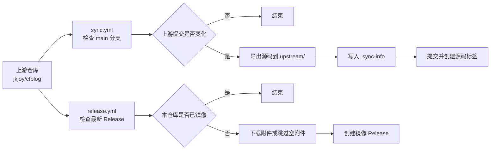

<div align="center">

# CFblog-mirror

CFBlog 上游仓库的源码与 Release 文件镜像

[](https://github.com/jkjoy/cfblog)
[](https://github.com/jkjoy/cfblog/tree/main)
[](https://github.com/hopol/CFblog-mirror/actions/workflows/sync.yml)
[](https://github.com/hopol/CFblog-mirror/actions/workflows/release.yml)
[](LICENSE)
[](https://github.com/jkjoy/cfblog/blob/main/LICENSE)

[上游仓库](https://github.com/jkjoy/cfblog) · [镜像 Releases](https://github.com/hopol/CFblog-mirror/releases) · [Actions](https://github.com/hopol/CFblog-mirror/actions)

</div>

---

## 📌 说明

本仓库用于镜像 [`jkjoy/cfblog`](https://github.com/jkjoy/cfblog) 的源码和 GitHub Release 文件。

- 源码来自上游 `main` 分支，导出到 `upstream/`。
- Release 文件来自上游最新 GitHub Release，并重新发布到本仓库的 Releases。
- 本仓库不修改上游源码，不重新构建发布文件，也不提供 CFBlog 的官方支持。

> [!NOTE]
> CFBlog 是基于 Cloudflare Workers、D1 和 R2 的博客系统，包含公开前台、`/wp-admin` 管理后台和 `/wp-json` API。部署、使用与更新信息请以上游仓库为准。

## 📁 镜像范围

| 内容 | 位置 | 说明 |
|---|---|---|
| 上游源码 | `upstream/` | 通过 `git archive` 从上游 `main` 分支导出。 |
| 同步信息 | `upstream/.sync-info` | 记录上游提交、同步时间、分支和版本号。 |
| 源码标签 | `mirror-source-v{版本}-{短提交}` | 对应一次源码同步。 |
| Release 文件 | 本仓库 Releases | 下载自上游 GitHub Release。 |
| Release 标签 | `mirror-release-{上游标签}` | 对应一个上游 Release。 |

## 🔄 自动同步



| 工作流 | 文件 | 默认时间（UTC） | 用途 |
|---|---|---:|---|
| 同步源码 | `.github/workflows/sync.yml` | 02:00 | 检查上游 `main` 分支，发现新提交后更新 `upstream/`。 |
| 镜像 Release | `.github/workflows/release.yml` | 02:37 | 检查上游最新 Release，发现未镜像的版本后创建本仓库 Release。 |

两个工作流都支持在 Actions 页面手动运行。

> [!IMPORTANT]
> GitHub Actions 中的定时任务使用 UTC 时间。当前 cron 表达式的日期字段为 `*/5`，实际运行日期通常是每月 1、6、11、16、21、26、31 日，不等同于严格每 5 天运行一次。

## 🧾 同步信息

每次源码同步后，`upstream/.sync-info` 会写入类似内容：

```ini
commit=0123456789abcdef...
timestamp=2026-08-07T00:00:00Z
upstream_url=https://github.com/jkjoy/cfblog
upstream_branch=main
version=1.5.0
```

| 字段 | 含义 |
|---|---|
| `commit` | 上游 `main` 分支的提交哈希。 |
| `timestamp` | 同步时间，UTC。 |
| `upstream_url` | 上游仓库地址。 |
| `upstream_branch` | 同步分支。 |
| `version` | 从上游 `package.json` 读取的 `version`。 |

同步脚本会在删除 `upstream/` 前读取已提交的 `.sync-info`。只有上游提交变化时，才会更新源码、创建提交和标签。

## 💻 本地同步源码

`sync.sh` 可用于本地手动同步源码；它不会处理 Release 文件。

### 要求

- Git；
- Bash 环境，例如 Linux、macOS、WSL 或 Git Bash；
- 能访问 GitHub；
- 如需推送结果，需要对本仓库有写入权限。

### 使用方式

```bash
git clone https://github.com/hopol/CFblog-mirror.git
cd CFblog-mirror
chmod +x sync.sh
./sync.sh
```

脚本会确认或添加 `upstream` 远程、拉取上游 `main` 分支和标签、对比上次同步记录；仅在上游有新提交时更新 `upstream/`、写入 `.sync-info`、提交变更并创建源码镜像标签。

## 🚀 Release 镜像

`release.yml` 会读取上游最新 Release。若本仓库不存在对应镜像标签，则会下载上游附件并创建镜像 Release。

- 本仓库标签名：`mirror-release-{上游标签}`；
- Release 说明包含上游 Release 链接和上游原始说明；
- 上游 Release 没有附件时，工作流会跳过下载并创建仅含说明的镜像 Release。

> [!WARNING]
> 本仓库不会校验、重签名或重新打包上游附件。下载和使用前请自行确认来源、版本和文件完整性。

## 🛠️ 维护常用命令

```bash
# 查看远程仓库
git remote -v

# 查看当前镜像对应的上游提交
git show HEAD:upstream/.sync-info

# 列出镜像标签
git tag -l 'mirror-*'

# 手动拉取上游 main 分支
git fetch upstream main --tags
```

## ❓ 常见问题

| 问题 | 处理方式 |
|---|---|
| Actions 无法推送提交或标签 | 检查仓库 Settings → Actions → General 中的 Workflow permissions，确保 `GITHUB_TOKEN` 有写入权限。 |
| 定时任务没有准时运行 | GitHub scheduled workflow 可能延迟，且时间按 UTC 计算。 |
| 获取不到上游分支 | 确认上游仍然存在 `main` 分支，并检查网络访问。 |
| Release 创建失败 | 查看 Actions 日志，重点检查 GitHub API、`GITHUB_TOKEN` 权限和上游 Release 信息。 |
| 源码同步每次都产生提交 | 检查 `upstream/.sync-info` 是否已提交，以及工作流是否在删除 `upstream/` 前读取旧记录。 |

## ⚖️ 许可证

| 内容 | 许可证 |
|---|---|
| 本仓库编写的脚本、工作流和文档 | [MIT License](LICENSE) |
| `upstream/` 中镜像的 CFBlog 源码 | 上游 [MIT License](https://github.com/jkjoy/cfblog/blob/main/LICENSE) |
| 上游 Release 附件和第三方组件 | 以对应上游项目、附件和依赖的许可证为准。 |

---

<div align="center">

本仓库只是镜像，不是 CFBlog 官方仓库。

[返回顶部](#cfblog-mirror)

</div>
